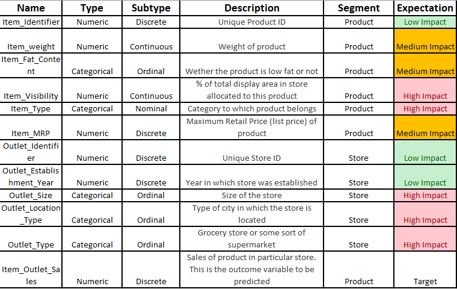
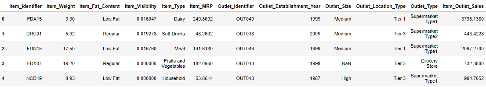
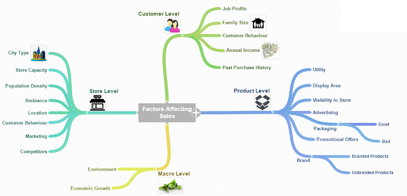
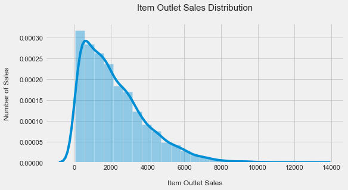

# Big Mart Sales Prediction

## Introduction
With the rapid development of global malls and stores chains and the increase in the number of electronic payment
customers, the competition among the rival organizations is becoming more serious day by day. Each organization is trying to
attract more customers using personalized and short-time offers which makes the prediction of future volume of sales of every
item an important asset in the planning and inventory management of every organization, transport service, etc. Due to the
cheap availability of computing and storage, it has become possible to use sophisticated machine learning algorithms for this
purpose. Here, we are providing forecast for the sales data of big mart in a number of big mart stores across various
location types which is based on the historical data of sales volume. According to the characteristics of the data, we can use the
method of multiple linear regression analysis and random forest to forecast the sales volume.

- The aim is to build a predictive model and find out the sales of each product at a particular store.
- Using this model, BigMart will try to understand the properties of products and stores which play a key role in increasing sales.

## Methodology involved in solving the problem
Raw data collected at big mart would be pre-processed for missing data, anomalies and outliers. Then an algorithm would be trained on this data to create a model. This model would be used for forecasting the final results.
Data preprocessing is a data mining technique used to transform sample raw data into an understandable format. Real world collected data may be inconsistent, incomplete or contains an error and hence data preprocessing is required.
- Big mart’s data scientists collected sales data for the year 2013 of 1559 products across 10 stores in different cities.
Also, they provided definitions for certain attributes of each product and store. They are as follows :

## Data
- This dataset contains 8523 observations and 12 features.

- The dataset contains sales data for the year 2013 of 1559 products across 10 stores in different cities.
- It was my belief that from this first look at the data, the variables that will have higher impact on the product’s sale price are: __Item_Visibility , Item_Type , OutletSize , Outlet_Location_Type , Outlet_Type__.
- The target variable is __Item_Outlet_Sales__.

## Regression Problem

In Machine learning, problems like Sales prediction are usually framed as Regression problems -- outlet sales a Discrete class label output for given data observation.

## Select a Performance Measure
Usually for regression problems, the typical performance measure is the __RootMean Square Error (RMSE)__. This function gives an idea of how much error the system makes in its predictions with higher weight for large errors.

## Hypothesis Generation 
After framing our problem and deciding on the performance measure, it is good to make some assumptions on what possible outcomes we might expect from our analysis according to the available data. Therefore, by knowing the goal we should think which possible factors might affect the sales prediction outcome. We can start by diving the process into four levels: Store level, Product level, Customer level and Macro level.

### Store Level Hypotheses:

__City type:__ Stores located in urban or Tier 1 cities should have higher sales because of the higher income levels of people there.

__Population Density:__ Stores located in densely populated areas should have higher sales because of more demand.
Store Capacity: Stores which are very big in size should have higher sales as they act like one-stop-shops and people would prefer getting everything from one place.

__Competitors:__ Stores having similar establishments nearby should have less sales because of more competition.
Marketing: Stores which have a good marketing division should have higher sales as it will be able to attract customers through the right offers and advertising.

__Location:__ Stores located within popular marketplaces should have higher sales because of better access to customers.

__Customer Behavior:__ Stores keeping the right set of products to meet the local needs of customers will have higher sales.

__Ambiance:__ Stores which are well-maintained and managed by polite and humble people are expected to have higher footfall and thus higher sales.

### Product Level Hypotheses:

__Brand:__ Branded products should have higher sales because of higher trust in the customer.
__Packaging:__ Products with good packaging can attract customers and sell more.
__Utility:__ Daily use products should have a higher tendency to sell as compared to the specific use products.
__Display Area:__ Products which are given bigger shelves in the store are likely to catch attention first and sell more.
__Visibility in Store:__ The location of product in a store will impact sales. Ones which are right at entrance will catch the eye of customer first rather than the ones in back.
__Advertising:__ Better advertising of products in the store will should higher sales in most cases.
__Promotional Offers:__ Products accompanied with attractive offers and discounts will sell more.

## EDA

- We can see that our target variable is skewed to the right, towards the higher sales, with higher concentration on lower sales.

- To make this distribution more symmetrical, we could try taking its square root. Nevertheless, my results showed that the RMSE increased with this alteration.

## Conclusion 

- After implementing the ML algorithm’s, __Random Forest model with Accuracy = 94% and RMSE=415 performed better__ which got me in the first 25%.
